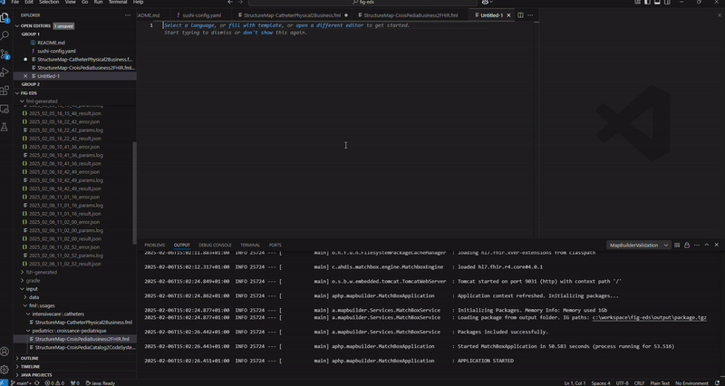

# FHIR MapBuilder Project

## Overview
FHIR MapBuilder is a Visual Studio Code extension designed to facilitate the edition of FHIR StructureMap resources 
using FHIR Mapping Language (FML).

FHIR® is the registered trademark of HL7 and is used with the permission of HL7.
Use of the FHIR trademark does not constitute endorsement of the contents of this repository by HL7

This extension assists users by offering the following features:
- Syntax highlighting
- Autocompletion
- FML templates
- StructureMap validation on test data

## FML execution on test data
This function works thanks to the java package fhir-mapbuilder-validation.jar: the springboot REST API based on 
[the matchbox-engine](https://github.com/ahdis/matchbox), provided in the target folder.

There is only one engine running, regardless the number of VSCode instance running. It is therefor strongly discouraged to have two FHIR IG oppened in two VSCode instances simultaneously. 

This function have 3 inputs:
- **FML file** to test (required)
- **JSON file**, that is an instance of the source StructureDefinition - as defined in the fml file to test (required)
- **Implementation Guide (IG) package** that contains the StructureDefinition (logical model) that are declared `as sources` in the fml `uses` (optional).

It may generate 3 files in the **fml-generated** folder:
- YYYY_MM_DD_HH_MM_SS_result.json: Stores the transformation result of the FML with the dataset (the output of the $transform operation).
- YYYY_MM_DD_HH_MM_SS_error.json: Contains all validation error messages related to the FML.
- YYYY_MM_DD_HH_MM_SS_params.log: Logs the files used during the process, including the FML file and the test instance.

Additional information is also displayed in the FHIR MapBuilder Validation output channel of Visual Studio Code.

This function is called from an open fml file by right-clicking anywhere in the editor. Three options are available:

### Validate StructureMap (With input selection)

1. Select the "Validate StructureMap (With input selection)" option.
2. Select the json test file

After few seconds, the results are available in the **fml-generated** folder.


### Validate StructureMap (Current input)

1. Select the "Validate StructureMap (Current input)" option.

The json test file, selected during a previous execution, is used automatically.

After few seconds, the results are available in the **fml-generated** folder.


### Load current package and Validate StructureMap

1. Select the "Load current package and Validate StructureMap" option
2. the package.tgz file available in the output folder is automatically loaded in the matchbox-engine.
3. Select the json test file

After few seconds, the results are available in the **fml-generated** folder.


### Troubleshoting
The FHIR MapBuilder use the output/package.tgz file to configure the matchbox-engine, which is the standardized place to 
store the package in a FIG building process. However, depending on your use case, you may not need such package.
There is no control for the `Validate StructureMap (Current input)` feature to make it fast to use. If there is no 
package while it should, the validation won't success (of course). In such scenario, you'll find a message in the error 
output file with the `"messageId": "TYPE_SPECIFIC_CHECKS_DT_CANONICAL_RESOLVE"`. This error also happen if the wrong 
package is loaded.

## Templates

To use a template, you need to apply it. There are two possible methods.

### `fill with template`function in a new document

1. Open a new text file using the ```Ctrl + N``` command.
2. Click on "Fill with template". A dropdown menu will appear, allowing you to choose which template to apply.
3. Select "FML Template", and the template will be applied.

### Using the Extension Command

1. Right-click in the text area of any open file
2. Select "Insert template FML", and the template will be inserted.

## Autocompletion

Autocompletion works with the FHIR core package.

It uses the `uses` and `group` definitions to provide suggestions.

The extension supports autocompletion for FHIR objects and their attributes when the user types in a .fml file.

Autocompletion for attributes is triggered when an object is followed by a dot (.), e.g., `Patient.`.




## 📜 License

This project is licensed under the [MIT License](../LICENSE).

